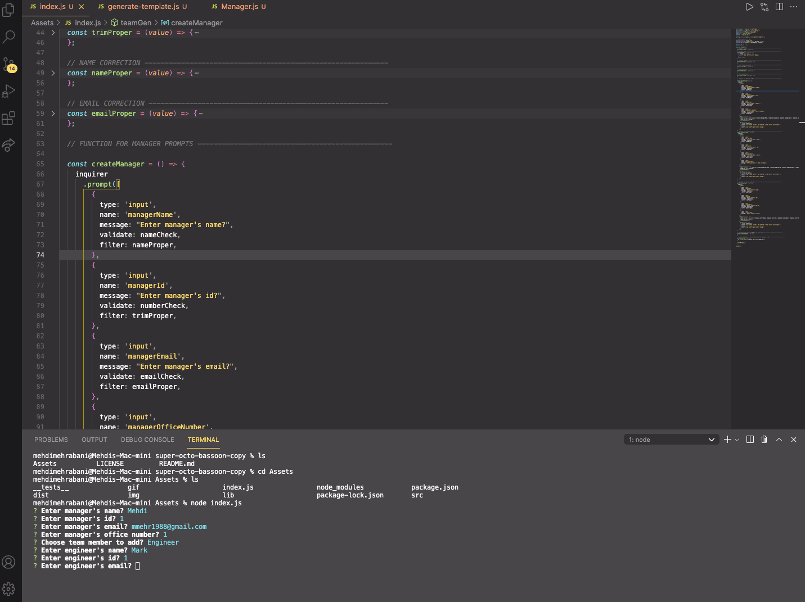

# super-octo-bassoon

## Project Title: Team Profile Generator

<a href="https://choosealicense.com/licenses/mit" target="_blank"></a>

## Table of Contents:

1. [Description](#description)
1. [Technologies](#technologies)
1. [Installation](#installation)
1. [Usage](#usage)
1. [Video](#video)
1. [Contributing](#contributing)
1. [Tests](#tests)
1. [License](#license)
1. [Questions](#questions)

## Description

This is a Node.js command-line application that takes in information about employees on a software engineering team, then generates an HTML webpage that displays summaries for each person.

## Technologies

1. [Node.js](https://www.npmjs.com/package/inquirer)

   a. [Inquirer Package](https://www.npmjs.com/package/inquirer) – For prompt messages.

   b. [Jest Package](https://jestjs.io/) – For testing.

   c. [Chalk Package](https://www.npmjs.com/package/chalk) – For the colorization of prompt messages.

1. [Bulma CSS Framework](https://bulma.io/) – CSS framework used to style the team profile.

## Installation

- Before cloning the repository, please ensure you have node.js installed as this is a command line application. If you do not have node.js installed, start with steps 1 and 2. If you have node.js installed and confirmed, you can skip steps 1 and 2 and begin on step 3.

  1.  [Node.js Download Page](https://nodejs.org/en/download/)

  2.  After install, check with command line to ensure setup is correct.

      a. Open your terminal

      b. Type the below command. If you see a version it means you have installed node.js correctly.

      ```bash
      node -v
      ```

  3.  Clone repository and open in VS Code.

  4.  Open Terminal in VS Code

      a. Shortcut = CTRL + `

  5.  Install the npm "inquirer" package by typing the below command.

      ```bash
      npm install
      ```

  6.  Once you hit enter, the correct dependencies for allowing you to use this application will be automatically installed.

## Usage

- Once you've completed the installation section guidelines, to run the application type the below command.

  ```bash
  node index.js
  ```

- The application will begin to run and you will be prompted with a series of questions to answer. See below image for the list of prompt messages and the following link for an example html file output - [Example HTML File](https://github.com/mmehr1988/super-octo-bassoon/blob/main/example/myTeam.html)


## Video

[Link To GIF ](https://github.com/mmehr1988/super-octo-bassoon/blob/main/gif/Team-Generator-GIF.gif)



## Contributing

Please open a Github issues request and I’ll review and respond as soon as I can. See below image for where to find the Issue page.


## Tests

Testing for this app is done through the use of the npm package Jest. There are a total of 28 tests performed for this app across four .js files. In order to run the unit tests please type the following command in terminal.

```bash
npm run test
```

## License

<a href="https://choosealicense.com/licenses/mit" target="_blank">MIT License</a>

## Questions

Github Portfolio Link: [Mehdi Mehrabani](https://github.com/mmehr1988)<br>
Email Contact: tatash.my@gmail.com

## Image of Final Output


